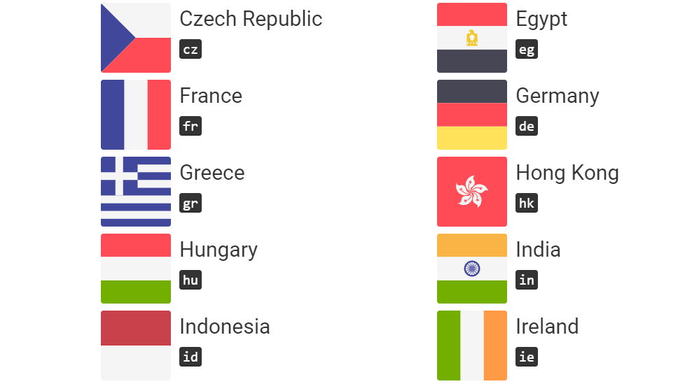

# Top-Global-Headlines

## Background

[NewsAPI](https://newsapi.org/) is a REST API for retrieving live news articles from over 35,000 sources; it indexes over 10 million articles every month.
With so much information, but with no real way of interpreting it, we decided to try to compare and contrast how newsworthy material varies daily by country around the globe.

## Summary (with links)
In short, this is done by extracting article summary paragraphs from NewsAPI, translating them into English, and breaking them down into keyword-pairs using a Rapid Automatic Keyword Extraction (RAKE) algorithm in Python.  After setup, most of the work is handled by executing the update.py file which will take several minutes to run, but the task progress is [viewable in the terminal](Images/newsapi_update.png). Update.py works by concatenating all headlines per country from that day, translating each country's headlines using translate.google.com API calls (via the py_translator module), stripping out meaningless special characters, performing analysis (keyword extraction), and stores all derived and original data in a Mongo database.  A simple Python HTTP Server must be created before running update.py to pull in new article headlines. In the future, I plan to deploy this app to Heroku and have this update run every 24 hours automatically, instead of having to locally host and manually update daily. You can view [individual country results](Images/newsapi_summary.png) by selecting a country from the [interactive map](Images/Interactive_Map.png). Also, a [Node Network](Images/Node_Network.png) 